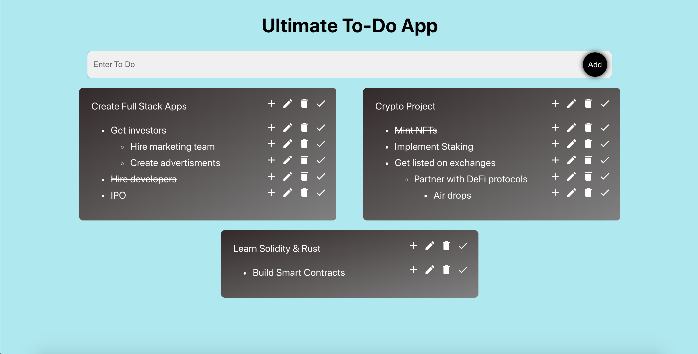

<h1>ToDo App - Using Recursion and Client Side Persistance</h1>

<ul><li>Goal 1: Create a to-do app with infinite potential sub-items where each sub-item can have their own sub-items.</ul></li>
<ul><li>Goal 2: Use client side persistance to remember to-do items when users reloaded page</ul></li>

 

<ul><li>url:</ul></li>

 

<h3>Tech Used</h3>

    <ul>
        <li>React & TypeScript</li>
        <li>Hooks for managing state</li>
        <li>Dexie.js for client browser DB using underlying indexeddb to store objects</li>
        <li>Recursive functions to scan tree datasctructure to find where to insert, edit, and delete items</li>
    </ul>

 

